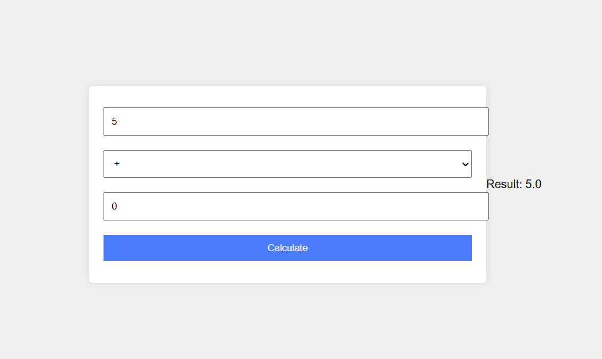

# Calculator App

This is a simple calculator web application built using HTML, CSS, and JavaScript. It provides basic arithmetic operations such as addition, subtraction, multiplication, and division, along with other functionalities like percentage and exponentiation.

## Features

- Basic arithmetic operations
- Percentage calculation
- Exponentiation
- Clear display with AC button

## Demo Video

[Watch the demo video](demo.mp4)

## How to Use

Simply open the `index.html` file in your web browser to start using the calculator. Press the buttons or use your keyboard to input numbers and perform calculations.